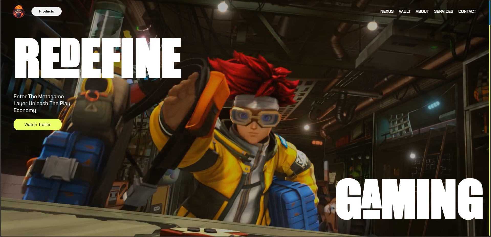

# 🎮 Zentry Cloning Gaming Website  

A **high-end gaming website** inspired by **Zentry Website** that wins **Awwwards-winning design**, built with **HTML, CSS, and JavaScript**. This project features **modern UI elements, unique scroll animations, and stunning visuals**, delivering a sleek and immersive experience for gaming enthusiasts.  

## ✨ Features  

✅ **Modern UI & Aesthetics** – Futuristic and stylish gaming look  
✅ **Unique Scroll Animations** – Custom scroll-triggered effects for an engaging experience  
✅ **Smooth Page Transitions** – Fluid navigation between sections  
✅ **Hover & Interactive Effects** – Dynamic elements with sleek animations   
✅ **Optimized Performance** – Fast loading and smooth interactions  
✅ **Minimal JavaScript** – Ensures lightweight and efficient code  

## 🖥️ Technologies Used  

- **HTML5** – Semantic and structured markup  
- **CSS3** – Advanced styling with animations, flexbox, and grid  
- **JavaScript (ES6+)** – Scroll animations, page interactions, and effects  

## 📸 Preview  

  

## 🚀 Live Demo  

[🔗 Live Demo Here](https://ahmedragab15.github.io/Zentry-Cloning)  